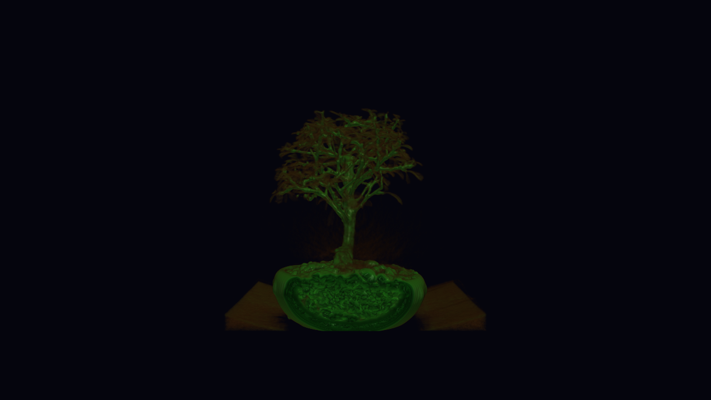

# SIVA

SIVA lets you build scientific visualizations by talking to an AI. You
describe what you want to see, the AI writes declarative pipeline code, and
you iterate together — exploring data, tuning parameters, and refining the
picture through conversation.

Here's what a pipeline file looks like — this volume-renders a CT scan of a
bonsai tree with a terrain colormap and gradient-enhanced opacity:

```python
data = source("vtkXMLImageDataReader", FileName="bonsai.vti")

show(data, "bonsai", representation="Volume",
    color_by="density", scalar_range=(20, 200), lut="terrain",
    opacity_function=[(0, 0.0), (18, 0.0), (26, 0.01), (36, 0.05),
                      (48, 0.13), (60, 0.26), (80, 0.48),
                      (110, 0.68), (150, 0.84), (220, 0.96)],
    gradient_opacity=True, shade=True)

background(0.02, 0.02, 0.05)
```



SIVA has two parts:

1. **A pipeline DSL** — a concise Python syntax for VTK visualization.
   You describe sources, filters, and display properties declaratively;
   SIVA wires up the VTK objects for you.

2. **An MCP server** — exposes the DSL and data query tools to any AI assistant
   via [Model Context Protocol](https://modelcontextprotocol.io/). The assistant
   can load data, explore field statistics, execute pipeline code, adjust the
   camera, and see screenshots — all through tool calls.

## Setup

SIVA works with any MCP-compatible AI assistant (Claude Code, Claude Desktop,
etc.). Point your assistant at the SIVA server and start a conversation in
the directory where your data lives.

### 1. Install

```bash
cd /path/to/SIVA
python3 -m venv .venv
source .venv/bin/activate
pip install -e .
```

### 2. Configure your AI assistant

Add SIVA to your project's `.mcp.json` (or your assistant's MCP settings),
pointing at the Python from the venv:

```json
{
  "mcpServers": {
    "SIVA": {
      "command": "/path/to/SIVA/.venv/bin/python",
      "args": ["-m", "siva.server", "--workdir", "/path/to/your/data"]
    }
  }
}
```

This opens a live VTK window where you can see the visualization update as
the AI builds it. `--workdir` sets the working directory for the session —
the server discovers data files there, and the pipeline files the AI writes
land there too. (Omit it to use the directory you launched the assistant
from.)

**Model tip:** With Claude Code, Opus at low reasoning effort has given the
best balance of speed and skill in our experience — smarter pipeline choices
than Sonnet without the latency of higher reasoning effort.

### 3. Start a conversation

Open a chat with your AI assistant (Claude Code, Claude Desktop, etc.) and
ask it to visualize your data:

> **You:** Load output.30000.vts and show me what's in it.
>
> **AI:** *(calls load(), describes fields, dimensions, value ranges)*
>
> **You:** Show me the temperature field — I want to see where it's hottest.
>
> **AI:** *(writes a pipeline with threshold + volume rendering, shows screenshot)*
>
> **You:** Can you add streamlines showing the wind flow through the hot region?
>
> **AI:** *(adds compute_velocity + stream_tracer to the pipeline, iterates)*

## Running pipelines directly

You can also run pipeline files directly, without the MCP server.
Activate the venv (or use its Python) and run:

```bash
# Open an interactive VTK window
python -m siva.run pipeline.py

# Save a screenshot
python -m siva.run pipeline.py -o output.png

# Custom resolution
python -m siva.run pipeline.py -o output.png --size 3840x2160
```

Useful for batch rendering, testing pipelines, or using SIVA without
an AI assistant.

## What it supports

- **Data formats:** VTK structured grids (`.vts`), image data (`.vti`),
  polydata (`.vtp`), unstructured grids (`.vtu`), rectilinear grids (`.vtr`),
  raw binary volumes
- **Visualization techniques:** isosurfaces, thresholds, volume rendering,
  cross-section slices, streamlines, glyphs, colormapping, clipping
- **Derived quantities:** vector fields from scalar components, vorticity,
  gradient magnitude, individual vector components
- **Interactivity:** camera control, opacity adjustment, colormap changes,
  text annotations, multi-view support

## Documentation

| Document | Description |
| -------- | ----------- |
| [Getting Started](docs/getting-started.md) | Architecture overview, workflow walkthrough, key patterns |
| [DSL Reference](docs/dsl-reference.md) | Complete reference for pipeline forms (`source`, `threshold`, `show`, etc.) |
| [MCP Tool Reference](docs/mcp-reference.md) | Complete reference for interactive tools (`describe_data`, `set_pipeline`, etc.) |
| [Server Instructions](docs/instructions.md) | The guidance string shown to AI assistants on connect |

Docs are auto-generated from source — run `python scripts/gen_docs.py` to regenerate
after code changes.

## Development

For contributors working on SIVA itself:

```
siva/
  server.py      MCP server and tool definitions
  dsl.py         DSL forms and pipeline interpreter
  renderer.py    VTK renderer
  queries.py     Query tool implementations
  filters.py     VTK filter creation and special-case handling
  colormaps.py   Colormap presets and field defaults
datasets/        Sample datasets, each with a download.sh script
scripts/         Development scripts (gen_docs.py, etc.)
docs/            Generated documentation
tests/           Test suite
```

```bash
# Install the project with dev dependencies (adds pytest)
pip install -e ".[dev]"

# Run the test suite
python -m pytest tests/ -q

# Regenerate documentation
python scripts/gen_docs.py
```

See [CLAUDE.md](CLAUDE.md) for detailed development guidance.


## Copyright
© 2025. Triad National Security, LLC. All rights reserved.

This program was produced under U.S. Government contract 89233218CNA000001 for Los Alamos National Laboratory (LANL), which is operated by Triad National Security, LLC for the U.S. Department of Energy/National Nuclear Security Administration. All rights in the program are reserved by Triad National Security, LLC, and the U.S. Department of Energy/National Nuclear Security Administration. The Government is granted for itself and others acting on its behalf a nonexclusive, paid-up, irrevocable worldwide license in this material to reproduce, prepare. derivative works, distribute copies to the public, perform publicly and display publicly, and to permit others to do so.