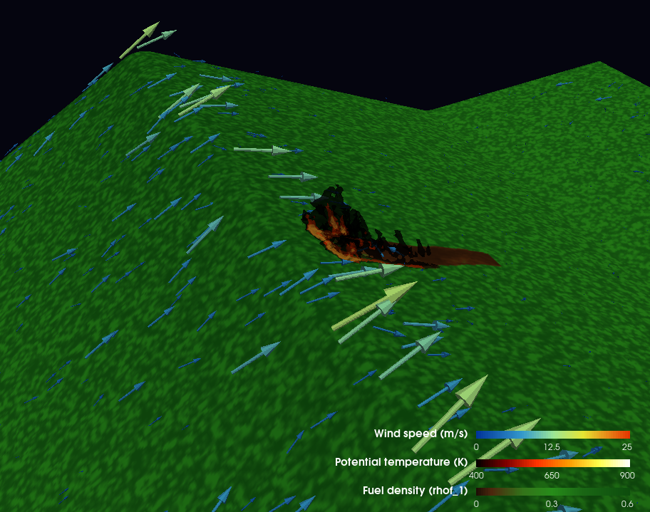
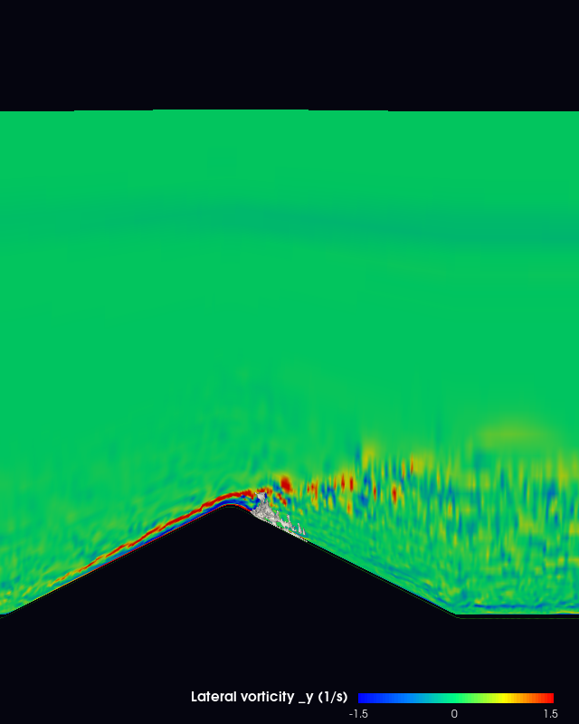
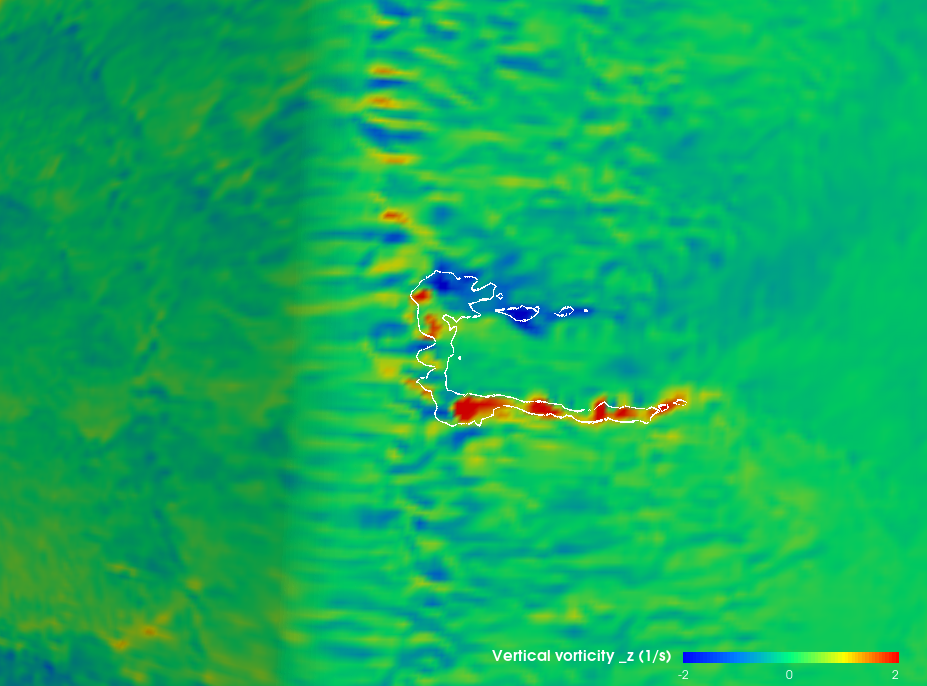
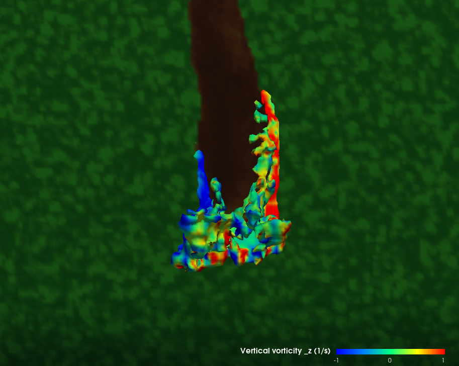
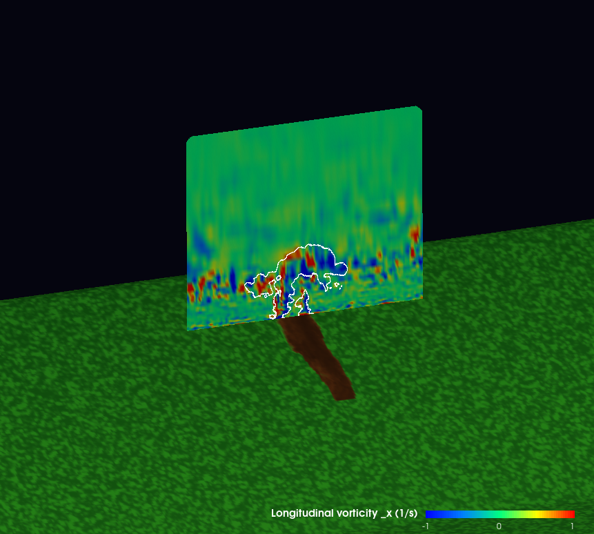

# Vorticity-Driven Lateral Spread (VLS) in a Wildfire Simulation

Most people picture a wildfire advancing in one direction — pushed by the wind, driven uphill. But on steep leeward slopes (the sheltered side of a ridge, away from the wind), fires sometimes spread *sideways* across the slope at unexpectedly rapid rates. This behavior is called **Vorticity-Driven Lateral Spread (VLS)**, and a 2015 paper by Sharples et al. ([pyrogenic-vorticity.pdf](pyrogenic-vorticity.pdf)) proposes a physical mechanism: the fire generates rotating columns of air — "pyrogenic vorticity" — that push hot air sideways across the ridgetop, igniting fuel ahead of where the wind alone would carry the flame.

This report walks through the mechanism using a large-eddy simulation of a wildfire on a ridge ([output.30000.vts](output.30000.vts)), with each step visualized from the model data.

## The setup: fire on a ridge

The simulation is a 600 × 500 × 61 terrain-following grid covering roughly a 1.2 km × 1 km patch of terrain, with a wind blowing in the +X direction at about 20 m/s. A small fire is burning near the ridgetop.

Reproduce: [view-main.py](view-main.py)

Green shading is fuel density (unburned vegetation), and the orange glow is the hot plume (isosurfaces of potential temperature from 400 K to 800 K). Arrows show the near-surface wind field, colored and scaled by wind speed — you can see the flow climbing the windward slope, accelerating near the ridgetop, and weakening behind the ridge where the flow separates.

## What is vorticity, and why does it matter here?

Vorticity is a measure of local rotation in a fluid — the curl of the wind field. You can think of it as a tiny paddle wheel sitting in the flow: how fast and around which axis is it spinning? Vorticity has three components:

- **ω_y (lateral)**: spinning around the crosswind axis — this is what rolling waves and shear layers look like
- **ω_z (vertical)**: spinning around the vertical axis — this is what tornadoes and dust devils look like
- **ω_x (longitudinal)**: spinning around the along-wind axis — this is what counter-rotating trailing vortices behind an aircraft look like

The paper's claim is that a lee-slope fire creates a *specific arrangement* of these vorticities that advects hot air sideways and drives lateral spread.

## Step 1: the supply — where lateral vorticity comes from

When wind blows over a ridge, the flow separates on the leeward side, leaving a layer of strongly-sheared air just above the surface. This shear layer is a **sheet of lateral vorticity ω_y** — exactly the "fuel" the paper argues gets tilted into the rotating columns that drive VLS.

We can see this directly in a cross-wind vertical slice through the simulation:

Reproduce: [view-omega-y.py](view-omega-y.py)

Wind is blowing from right to left. On the windward (right) slope, ω_y is a thin red sheet glued to the surface — just a boundary layer. On the leeward (left) slope, the flow separates at the crest, and you can see a strong **blue layer** (negative ω_y) capping the lee just above the surface with **red** above — the lifted vortex sheet that the paper's Figure 2 predicts. This confirms the simulation is in the lee-slope regime where VLS is possible.

## Step 2: the driver — vertical vortex pair

The paper's key physical argument is that the fire's buoyant updraft *tilts* the lateral ω_y sheet into vertical vorticity ω_z on the fire's flanks — producing two counter-rotating columns, one spinning clockwise (viewed from above) and the other counter-clockwise. These columns then **advect hot air sideways across the ridgetop**, igniting fuel to the left and right of the fire rather than just downwind.

We can look for this pair from directly above. First, a ground-hugging horizontal slice colored by ω_z, with the fire's footprint outlined in white:

Reproduce: [view-vorticity.py](view-vorticity.py)

The strongest red/blue activity (positive and negative vertical vorticity) hugs the fire's perimeter and downwind flanks — exactly where the paper predicts. The pattern is turbulent and noisy (this is a realistic LES, not an idealized schematic), but the signature is clear.

We can see the same vertical vortex pair by coloring the plume isosurface itself, viewed from above:

Reproduce: [view-omega-x-plume.py](view-omega-x-plume.py)

The plume's downwind edge shows a striking red stripe on one flank and a blue stripe on the other — two counter-rotating vertical columns with opposite spin. These are the rotors the paper's theory predicts, and their orientation is exactly right for sweeping hot air outward to either side.

## Step 3: the other half — longitudinal vorticity on the flanks

The paper also predicts a **longitudinal** vortex pair (ω_x) on the fire's flanks, arising from baroclinic torque (caused by the fire's buoyancy-driven density gradients). Together with ω_z, this completes the "pyrogenic vorticity" vector ω_p = (ω_x, 0, ω_z) — a single tilted vortex pair leaning downwind.

A vertical slice cutting through the fire, looking downwind, shows this component:

Reproduce: [view-omega-x.py](view-omega-x.py)

The white outline shows where warm, fire-affected air crosses the slice. Inside and immediately around the plume you can see a clear pattern: **red (ω_x > 0) on one flank, blue (ω_x < 0) on the other**, with a sharp sign change right through the rising column. The burn scar on the ground just below (dark brown fuel-depleted patch) anchors the vorticity structure to its source — the fire.

## Putting it together

The three views above reproduce the complete physical story from the paper, directly in the simulation data:

1. **Lateral vorticity ω_y** exists in an elevated sheet on the leeward slope (Step 1). This is the ambient supply.
2. **The fire's buoyant updraft tilts this lateral vorticity into vertical vorticity ω_z** on its flanks, producing a counter-rotating pair of vertical columns (Step 2). These columns sweep hot air sideways across the ridgetop.
3. **Longitudinal vorticity ω_x** also develops on the flanks through baroclinic effects of the hot, low-density plume (Step 3). Combined with ω_z, this gives a tilted vortex pair — the "pyrogenic vorticity" of the paper's title.

The practical upshot: on steep lee slopes, a fire doesn't just ride the wind. It manufactures its own rotating circulation that advects heat laterally, which is why wildfires on leeward terrain can spread sideways much faster than wind speed and direction alone would suggest — and why VLS is a distinct, dangerous mode of extreme fire behavior that firefighters and fire managers need to plan for.
